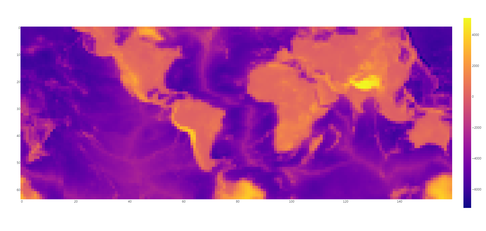

# Scripts for Markley’s tetrahedral projection

Here are some scripts to generate low-resolution, tileable map images with F. Landis Markley’s projection (1982).

See https://observablehq.com/@fil/markley for more infomation about Markley’s projection.

### Inverting Markley's projection

`grid.js` inverts grid points to latitudes and longitudes and write to `grid.jsonl`.

### Generating heightmap

`generate_map.py` loads `grid.jsonl` and calculates heightmap from [GEBCO_2021](https://www.gebco.net/data_and_products/gridded_bathymetry_data/gebco_2021/) data.
This takes a few hours to finish.

Generated heightmaps are saved as `heightmap_east.npy` and `heightmap_west.npy`.
